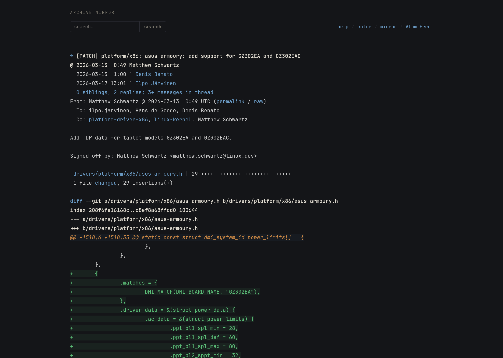

# Lore Beautifier

Dark theme and layout fix for [lore.kernel.org](https://lore.kernel.org).

lore.kernel.org puts everything in `<pre>` tags. Fine for `lynx`, rough for anyone staring at patch threads for hours. This fixes the colors, the font, the diff highlighting, and the header layout.

## What's in the box

Two files, each does one thing:

`lore-beautifier.user.css` -- dark theme for Stylus:
- Dark palette, warm tones, all contrast ratios at WCAG AA or above
- Diffs: green additions, red deletions, orange hunk headers
- IBM Plex Mono with tabular numerals
- Respects `prefers-reduced-motion` and `prefers-contrast: more`
- Print styles included

`lore-beautifier.user.js` -- header fix for Tampermonkey:
- Pulls search bar and nav links out of the `<pre>` block
- Rebuilds them as a flexbox row (search left, nav right)
- Hides the original to close the gap

CSS does all the styling. JS does only DOM work.

## Install

### Stylus

1. Install [Stylus](https://addons.mozilla.org/firefox/addon/styl-us/)
2. Open `lore.kernel.org`
3. Click Stylus icon, click the domain name
4. Paste `lore-beautifier.user.css`, Ctrl+S

### Tampermonkey

1. Install [Tampermonkey](https://addons.mozilla.org/firefox/addon/tampermonkey/)
2. Dashboard -> new script
3. Paste `lore-beautifier.user.js`, Ctrl+S

Reload. Done.

## Palette

| Variable | Hex | Ratio | Use |
|---|---|---|---|
| `--lb-bg` | `#141518` | -- | Background |
| `--lb-text` | `#b8b4aa` | 8.5:1 | Body text |
| `--lb-text-dim` | `#7a766c` | 4.1:1 | Secondary text |
| `--lb-link` | `#6d9fca` | 5.2:1 | Links |
| `--lb-green` | `#5cbe78` | 6.8:1 | Diff additions |
| `--lb-red` | `#d06868` | 4.7:1 | Diff deletions |
| `--lb-orange` | `#cc8844` | 5.1:1 | Hunk headers |
| `--lb-accent` | `#c9a654` | 5.6:1 | Accent, keywords |

Ratios against `#141518`.

## License

MIT
